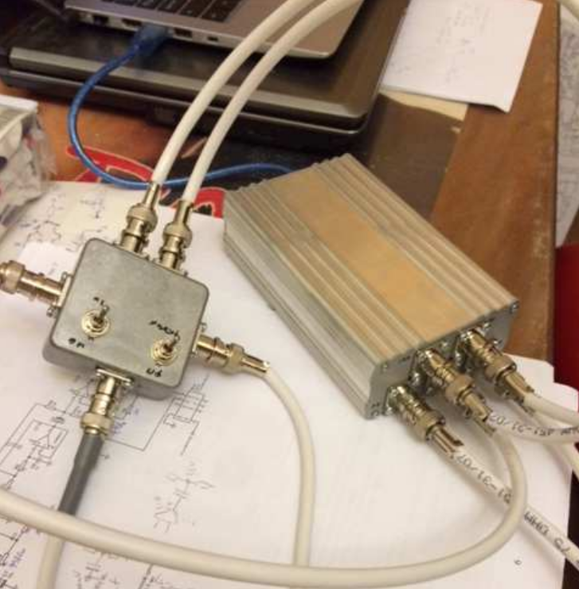
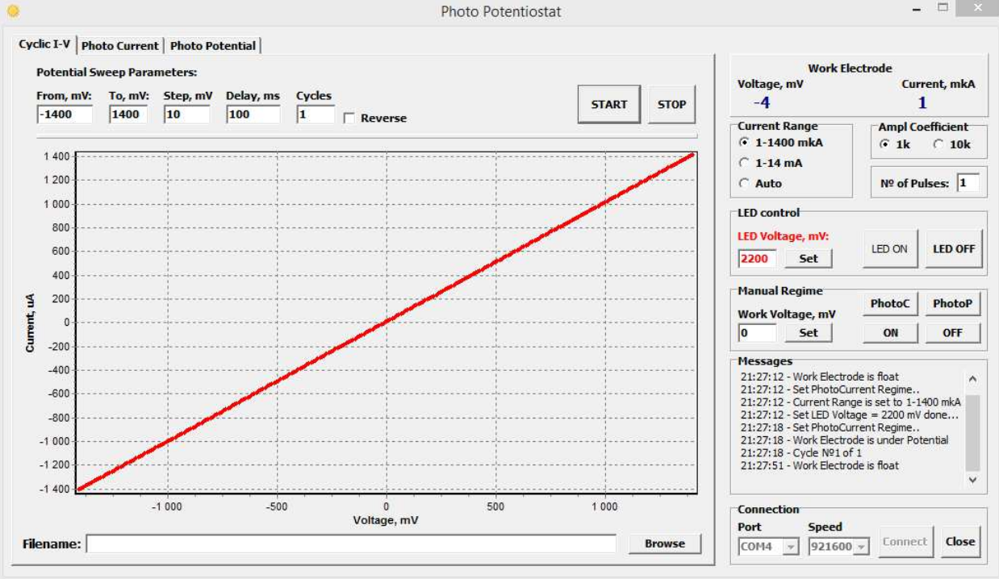
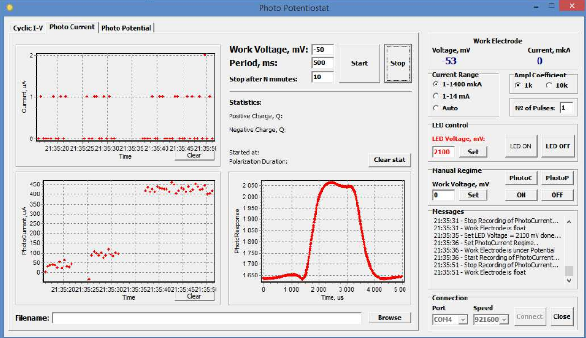
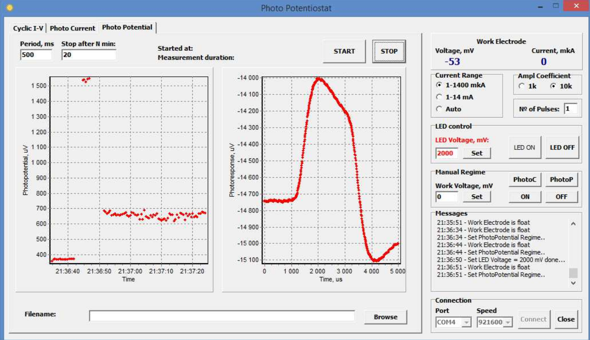

# Intelligent potentiostat (IPot)

A scientific device aimed to provide electrochemical measurements with 3-electrode cell. The main feature is a measurement of photocurrent and photovoltage.

## Characteristic

Powered from USB: 4.8-5 вольт
Work electrode voltage range: -1.4..+1.4 V ± 2 mV
Work electrode current ranges:
- -1400 mkA..+1400 mkA ± 2 mkA
- -14 mA..+14 mA ± 20 mkA

Potential sweep step / delay: 1 mV / 100 ms

Photocurrent measurement level: 20 nA..1200 nA

Photopotential measurement level: 0.5 mkV..1500 mkV

## Software
Written with Delphi 2007.

## Used language features
Com port, files IO, charts, math algorithms
